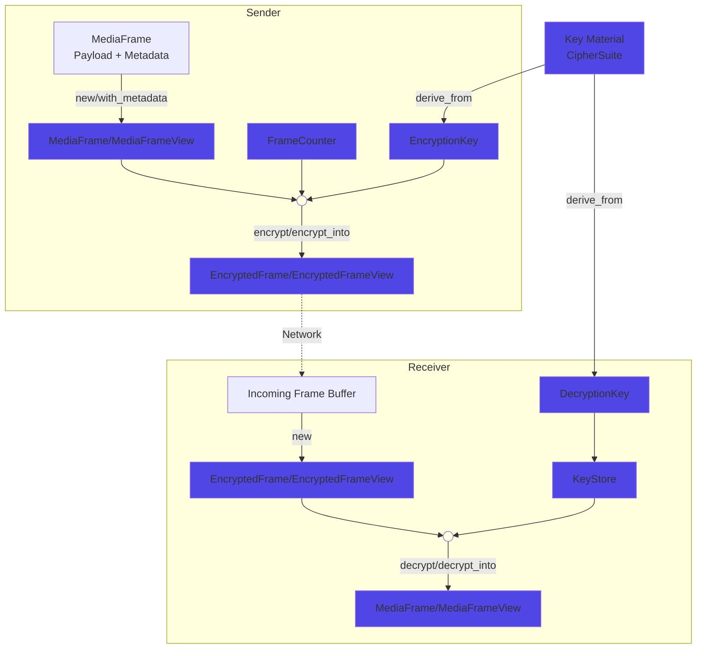

# Secure Frame (SFrame)

[](https://github.com/TobTheRock/sframe-rs/actions?query=branch%3Amain)
[](https://crates.io/crates/sframe/)
[](https://crates.io/crates/sframe)
[](https://crates.io/crates/sframe/)
[](https://docs.rs/sframe/)


This library is an implementation of [Sframe  (RFC 9605)](https://www.rfc-editor.org/rfc/rfc9605.html) and provides and end-to-end encryption mechanism for media frames that is suited for WebRTC conferences.
It was forked from the original [goto-opensource/secure-frame-rs](https://github.com/goto-opensource/secure-frame-rs) and is continued here.

## Supported crypto libraries

Currently two crypto libraries are supported:

- [ring](https://crates.io/crates/ring)
  - is enabled per default with the feature `ring`
  - supports compilation to Wasm32
  - Aes-CTR mode ciphers are not supported
- [openssl](https://crates.io/crates/openssl)
  - is enabled with the feature `openssl`
    - To build e.g. use `cargo build --features openssl --no-default-features`
  - uses rust bindings to OpenSSL.
  - Per default the OpenSSL library is locally compiled and then statically linked. The build process requires a C compiler, `perl` (and `perl-core`), and `make`. For further options see the [openssl crate documentation](https://docs.rs/openssl/0.10.55/openssl/).
  - Compilation to Wasm32 is [not yet supported](https://github.com/sfackler/rust-openssl/issues/1016)
- rust crypto
  - is enabled with the feature `rust-crypto`
    - to build e.g. use `cargo build --features rust-crypto --no-default-features`
  - pure rust implementation of the necessary crypto primitives (AES-GCM, SHA-512, HKDF, AES-CTR)
  - Compilation to Wasm32 is supported

Both cannot be enabled at the same time, thus on conflict `sframe` issues a compiler error.

## Usage

The API provides low-level access to encryption and decryption at the frame level.

It allows the use of arbitrary buffers, enabling the creation of views to avoid unnecessary copies:

- `MediaFrameView` for unencrypted data
- `EncryptedFrameView` for encrypted data

For encryption and decryption, a buffer must be provided implementing the `FrameBuffer` trait to allocate the necessary memory.
For convenience, this trait has already been implemented for `Vec<u8>`.

There is also a variant which allocates the necessary memory and owns the buffers:

- `MediaFrame` for unencrypted data
- `EncryptedFrame` for encrypted data

To convert between `MediaFrame(View)` and `EncryptedFrame(View)` , an `EncryptionKey` or `DecryptionKey` is needed,
which needs to be derived from a shared and secret key material.



For example:

```rust

use sframe::{
    frame::{EncryptedFrameView, MediaFrameView, MonotonicCounter},
    key::{DecryptionKey, EncryptionKey},
    CipherSuite,
};

let key_id = 42u64;
let enc_key = EncryptionKey::derive_from(CipherSuite::AesGcm256Sha512, key_id, "pw123").unwrap();
let mut counter = MonotonicCounter::default();
let payload = "Something secret";

let mut encrypt_buffer = Vec::new();
let mut decrypt_buffer = Vec::new();
let media_frame = MediaFrameView::new(&mut counter, payload);

let encrypted_frame = media_frame.encrypt_into(&enc_key, &mut encrypt_buffer).unwrap();

let mut dec_key = DecryptionKey::derive_from(CipherSuite::AesGcm256Sha512, key_id, "pw123").unwrap();
let decrypted_media_frame = encrypted_frame
    .decrypt_into(&mut dec_key, &mut decrypt_buffer)
    .unwrap();

assert_eq!(decrypted_media_frame, media_frame);
```

Additionally the library provides:

- Ratchet support as of [RFC 9605 5.1](https://www.rfc-editor.org/rfc/rfc9605.html#section-5.1)
- Sframe MLS definitions as of [RFC 9605 5.2](https://www.rfc-editor.org/rfc/rfc9605.html#name-mls)

## Examples

- [sender_receiver](https://github.com/TobTheRock/sframe-rs/blob/main/examples/sender_receiver)
  - Demonstrates how the API can be used in an application to encrypt and decrypt frames between two parties.
  - Implements a `Sender` which encrypts frames  `Receiver` which decrypts them.
  - Shows how to use the ratchet mechanism and the frame validation (Reply Protection).
- [bip_frame_buffer](https://github.com/TobTheRock/sframe-rs/blob/main/examples/bip_frame_buffer.rs)
  - Demonstrates how to use the API with an arbitrary buffer implemetation with the `FrameBuffer` trait.
- [generate_headers](https://github.com/TobTheRock/sframe-rs/blob/main/examples/generate_headers.rs)
  - Serialize/Deserialize the plain SFrame headers.

## Benchmarks

The `criterion` benchmarks located at [./benches](https://github.com/TobTheRock/sframe-rs/tree/feat/low-level-api/benches) currently test

- encryption/decryption with all available cipher suites and different frame size
- key derivation with all available cipher suites
- header (de)serialization

They are tracked continously with a [Bencher Perf Page](https://bencher.dev/perf/sframe-rs?back=L2NvbnNvbGUvb3JnYW5pemF0aW9ucy90b2J0aGVyb2NrL3Byb2plY3RzP3Blcl9wYWdlPTgmcGFnZT0x&key=true&reports_per_page=4&branches_per_page=8&testbeds_per_page=8&benchmarks_per_page=8&reports_page=1&branches_page=1&testbeds_page=1&benchmarks_page=1):

|                        |                  |
|------------------------|------------------|
| [](https://bencher.dev/perf/sframe-rs?key=true&reports_per_page=4&branches_per_page=8&testbeds_per_page=8&benchmarks_per_page=8&reports_page=1&branches_page=1&testbeds_page=1&benchmarks_page=1&branches=99fe8511-3287-48d2-93f3-36379605c572&heads=99fe8511-3287-48d2-93f3-36379605c572&testbeds=388324aa-501e-49ca-b012-3e1054b4b2a5%2Cb02e6299-bb69-4543-a09f-e168f88d72a0%2C5725e1c7-0c8c-4dcf-9afc-6ac4ff30c7b7&benchmarks=aa4e3c86-7cbe-4531-9cda-f1718843eece%2C49f6ad47-88db-4648-82f2-cbd9f6c8c0dd%2Ca8fc78f0-437f-4015-bbca-54988a7ef2c3%2Cac01dbfe-7841-4813-9016-e6c2fb5b3e2a%2C7dab951e-b008-4748-9467-bceddbdc6c97%2Cee85f06b-08c8-4741-81e4-c5a7e5a33856%2Cacf725e4-cd56-4471-bd94-ef143db7da78%2C8a5754f5-c03a-495d-b9a8-9ab927ccfebf%2C8fa81434-f422-4dbf-b209-df4a7ec710a8%2C757fa277-0938-49d6-8627-4502a9de9a29&measures=e050a8d7-e788-4ce5-9e95-48870f805da3&start_time=1732795740000&lower_boundary=false&upper_boundary=false&clear=true&plots_per_page=8&plots_page=1&tab=testbeds&utm_medium=share&utm_source=bencher&utm_content=img&utm_campaign=perf%2Bimg&utm_term=sframe-rs) | [](https://bencher.dev/perf/sframe-rs?lower_value=false&upper_value=false&lower_boundary=false&upper_boundary=false&x_axis=date_time&branches=99fe8511-3287-48d2-93f3-36379605c572&testbeds=388324aa-501e-49ca-b012-3e1054b4b2a5%2Cb02e6299-bb69-4543-a09f-e168f88d72a0%2C5725e1c7-0c8c-4dcf-9afc-6ac4ff30c7b7&benchmarks=aa4e3c86-7cbe-4531-9cda-f1718843eece%2C49f6ad47-88db-4648-82f2-cbd9f6c8c0dd%2Ca8fc78f0-437f-4015-bbca-54988a7ef2c3%2Cac01dbfe-7841-4813-9016-e6c2fb5b3e2a%2C7dab951e-b008-4748-9467-bceddbdc6c97%2Cee85f06b-08c8-4741-81e4-c5a7e5a33856%2Cacf725e4-cd56-4471-bd94-ef143db7da78%2C8a5754f5-c03a-495d-b9a8-9ab927ccfebf%2C8fa81434-f422-4dbf-b209-df4a7ec710a8%2C757fa277-0938-49d6-8627-4502a9de9a29&measures=e050a8d7-e788-4ce5-9e95-48870f805da3&start_time=1730649647746&tab=plots&plots_search=c1bde76d-0e9a-4435-bdd7-6014ff02bb08&key=true&reports_per_page=4&branches_per_page=8&testbeds_per_page=8&benchmarks_per_page=8&plots_per_page=8&reports_page=1&branches_page=1&testbeds_page=1&benchmarks_page=1&plots_page=1&utm_medium=share&utm_source=bencher&utm_content=img&utm_campaign=perf%2Bimg&utm_term=sframe-rs) |
| [](https://bencher.dev/perf/sframe-rs?lower_value=false&upper_value=false&lower_boundary=false&upper_boundary=false&x_axis=date_time&branches=99fe8511-3287-48d2-93f3-36379605c572&testbeds=388324aa-501e-49ca-b012-3e1054b4b2a5%2Cb02e6299-bb69-4543-a09f-e168f88d72a0%2C5725e1c7-0c8c-4dcf-9afc-6ac4ff30c7b7&measures=e050a8d7-e788-4ce5-9e95-48870f805da3&start_time=1730649647746&tab=benchmarks&plots_search=c1bde76d-0e9a-4435-bdd7-6014ff02bb08&key=true&reports_per_page=4&branches_per_page=8&testbeds_per_page=8&benchmarks_per_page=8&plots_per_page=8&reports_page=1&branches_page=1&testbeds_page=1&benchmarks_page=3&plots_page=1&clear=true&benchmarks_search=encrypt&benchmarks=757fa277-0938-49d6-8627-4502a9de9a29%2C957e48a3-1efe-4fe5-a1dd-d8c5405d77d9&utm_medium=share&utm_source=bencher&utm_content=img&utm_campaign=perf%2Bimg&utm_term=sframe-rs) | [](https://bencher.dev/perf/sframe-rs?lower_value=false&upper_value=false&lower_boundary=false&upper_boundary=false&x_axis=date_time&branches=99fe8511-3287-48d2-93f3-36379605c572&testbeds=388324aa-501e-49ca-b012-3e1054b4b2a5%2Cb02e6299-bb69-4543-a09f-e168f88d72a0%2C5725e1c7-0c8c-4dcf-9afc-6ac4ff30c7b7&measures=e050a8d7-e788-4ce5-9e95-48870f805da3&start_time=1730649647746&tab=benchmarks&plots_search=c1bde76d-0e9a-4435-bdd7-6014ff02bb08&key=true&reports_per_page=4&branches_per_page=8&testbeds_per_page=8&benchmarks_per_page=8&plots_per_page=8&reports_page=1&branches_page=1&testbeds_page=1&benchmarks_page=2&plots_page=1&clear=true&benchmarks_search=encrypt&benchmarks=acf725e4-cd56-4471-bd94-ef143db7da78%2C8a5754f5-c03a-495d-b9a8-9ab927ccfebf%2C8fa81434-f422-4dbf-b209-df4a7ec710a8&utm_medium=share&utm_source=bencher&utm_content=img&utm_campaign=perf%2Bimg&utm_term=sframe-rs) |
<a href="https://bencher.dev/perf/sframe-rs?lower_value=false&upper_value=false&lower_boundary=false&upper_boundary=false&x_axis=date_time&branches=99fe8511-3287-48d2-93f3-36379605c572&testbeds=388324aa-501e-49ca-b012-3e1054b4b2a5%2Cb02e6299-bb69-4543-a09f-e168f88d72a0%2C5725e1c7-0c8c-4dcf-9afc-6ac4ff30c7b7&measures=e050a8d7-e788-4ce5-9e95-48870f805da3&start_time=1730649647746&tab=benchmarks&plots_search=c1bde76d-0e9a-4435-bdd7-6014ff02bb08&key=true&reports_per_page=4&branches_per_page=8&testbeds_per_page=8&benchmarks_per_page=8&plots_per_page=8&reports_page=1&branches_page=1&testbeds_page=1&benchmarks_page=1&plots_page=1&clear=true&benchmarks_search=key&benchmarks=abd325b0-57e2-411c-8a86-4ef6d1c45279%2Cf144e648-b192-4514-81fc-f14bca4fba41%2Cf817d982-5073-45d1-8727-021569683502&utm_medium=share&utm_source=bencher&utm_content=img&utm_campaign=perf%2Bimg&utm_term=sframe-rs"></a>

## Contribution

Any help in form of descriptive and friendly issues or comprehensive pull requests are welcome!

The Changelog of this library is generated from its commit log, there any commit message must conform with <https://www.conventionalcommits.org/en/v1.0.0/>. For simplicity you could make your commits with convco.

#### License

<sup>
Licensed under either of Apache License, Version 2.0 or MIT license at your option.
</sup>

<br>

<sub>
Unless you explicitly state otherwise, any contribution intentionally submitted for inclusion in this project by you, as defined in the Apache-2.0 license, shall be dual licensed as above, without any additional terms or conditions.
</sub>
