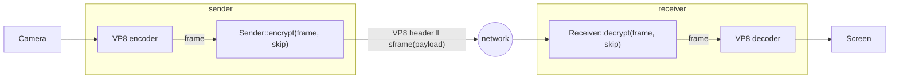

# sframe WebRTC Encoded Transform demo

End-to-end encrypted WebRTC in a single browser tab, all in Rust. The point of
the example is to show **where sframe plugs into a real media pipeline**: two
peer connections are wired up in loopback, and each VP8 frame is encrypted with
sframe on its way out and decrypted on its way in.

It builds on top of the [`sender_receiver`](../sender_receiver) example, reusing
its `Sender`/`Receiver` setup and dropping it into a live WebRTC pipeline.

## How sframe is used

sframe sits in the [WebRTC Encoded Transform][encoded-transform] - the hook that
hands you each encoded frame between the codec and the network:



Each side owns one sframe object, keyed from a passphrase:

```rust
// sender
let mut sender = Sender::new(key_id);
sender.set_encryption_key(passphrase)?;

// receiver
let mut receiver = Receiver::default();
receiver.set_encryption_key(key_id, passphrase)?;
```

Encrypting and decrypting a frame is then one call each. The trick is to skip
the first few bytes of a VP8 frame (its payload header), as it must stay readable for
the packetizer downstream. The VP8 header is *not* encrypted - they are passed as
sframe metadata (AAD) and authenticated instead of hidden:

```rust
// leaves frame[..skip] in the clear, encrypts the rest, authenticates both
let skip = vp8_header_len(frame)?;
let encrypted = sender.encrypt(frame, skip)?;   // VP8 header ‖ sframe(payload)
let restored  = receiver.decrypt(encrypted, skip)?; // == original frame
```

That's the whole integration - see [`src/transform.rs`](src/transform.rs). A
wrong key or a tampered header makes `decrypt` fail, the frame is dropped, and
the remote video stays blank.

## Run

Inside the project's Nix dev shell (`nix develop` provides the wasm toolchain,
Trunk, and the clang needed to cross-compile `ring`):

```sh
trunk serve --open
```

Allow camera access and click **Start**. Then:

- Change one passphrase and click **Update passphrases** - decryption breaks live
  and the remote goes blank. Match them again and it recovers.
- **Stop** tears the call down.

Requires a browser with `RTCRtpScriptTransform` (Chrome/Edge, Firefox, Safari).

## Implementation notes

Everything below is plumbing around the sframe usage above:

- UI is [Leptos] ([`src/bin/app.rs`](src/bin/app.rs)), built with [Trunk].
- `RTCRtpScriptTransform` mandates a worker, so the transform runs in
  [`src/bin/worker.rs`](src/bin/worker.rs); [`worker-bootstrap.js`](worker-bootstrap.js)
  is the minimal JS that boots its wasm (a wasm worker can't start with zero JS).
- `Sender`/`Receiver` are reused from the [`sender_receiver`](../sender_receiver)
  example via `#[path]` include.
- The Encoded Transform bindings are unstable in web-sys, hence
  `--cfg=web_sys_unstable_apis` in [`.cargo/config.toml`](.cargo/config.toml).
- Not using the Nix shell? Also set `CC_wasm32_unknown_unknown=$(command -v clang)`
  so `ring`'s C is cross-compiled to wasm.

[Leptos]: https://leptos.dev/
[Trunk]: https://trunkrs.dev/
[encoded-transform]: https://developer.mozilla.org/en-US/docs/Web/API/RTCRtpScriptTransform
